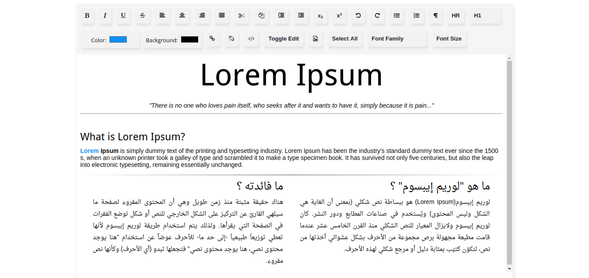

## Rich text editor

## Description

lightweight Rich Text Editor written in Javascript that offers rich text editing capabilities to your users.



## Installing / Getting started

To install this project you need to clone or download it.


```shell
git clone https://github.com/jamalhassouni/Rich-text-editor.git
cd Rich-text-editor
```
## Running locally
Serve folder with your server of choice.
 For instance 
1. by using  `npm install -g serve`.

2. Make sure you are in the same path 
```shell 
   cd Rich-text-editor
```
3. Run `serve .`
4. Now you can browse [http://localhost:5000](http://localhost:5000)

## Technology

- HTML
- CSS
- Javascript